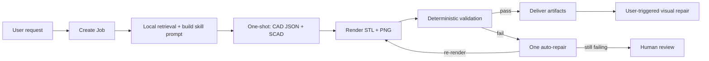

# AgentSCAD Architecture

AgentSCAD is organized like a production agent project rather than a single prompt demo. The model-facing layer describes CAD reasoning in Markdown skills; the runtime layer keeps rendering, validation, persistence, artifact paths, and streaming in deterministic code.

## Stack

- **Frontend**: React 19 + Next.js 16 App Router + Tailwind CSS v4 + Shadcn UI
- **Backend API**: Next.js Route Handlers
- **Database**: SQLite with Prisma ORM
- **Runtime CAD dependency**: external OpenSCAD CLI, invoked through `OPENSCAD_BIN` or `openscad`

## Repo Mental Model

| Layer | What it owns | Where to look |
|---|---|---|
| Agent workflow | Job state machine, retries, SSE progress, automatic workspace refresh | `src/lib/pipeline/`, `src/app/api/jobs/[id]/process/route.ts`, `src/app/api/cron/route.ts` |
| Skills | CAD reasoning contracts, repair strategy, validation review, library usage policy | `skills/scad-*`, `skills/RESOLVER.md` |
| Tools | Deterministic render, validation, SCAD sanitization, parameter extraction, artifact IO | `src/lib/tools/`, `scripts/validate_stl.py` |
| Repair | Validation-driven LLM repair, user-triggered VLM visual repair | `src/lib/repair/`, `src/app/api/jobs/[id]/repair/route.ts`, `src/app/api/jobs/[id]/visual-repair/route.ts` |
| Validation | Compile, bbox, component, hole count, mesh checks | `src/lib/validation/`, `src/lib/mesh-validator.ts`, `src/lib/visual-validator.ts` |
| Retrieval | Local keyword-based example retrieval for generation prompts | `src/lib/retrieval/`, `cad_knowledge/` |
| Std Library | Reusable OpenSCAD modules (plates, brackets, enclosures, fasteners) | `openscad_lib/agentscad_std.scad`, `openscad_lib/README.md` |
| Memory | Job state, version history, artifacts, learned patterns | `prisma/schema.prisma`, `src/lib/version-tracker.ts`, `src/lib/improvement-analyzer.ts` |
| Workspace UI | CAD viewport, job queue, parameter editing, visual repair button | `src/components/cad/`, `src/app/` |

## Runtime Workflow

At runtime, `executeCadJob()` owns the state transitions:

| Stage | State / step | What happens |
|---|---|---|
| Intake | `NEW` / `starting` | Load job, merge parameter values, detect part family. |
| Generation | `NEW` / `generating_llm` | Local example retrieval → one-shot structured CAD JSON + SCAD generation with standard library. |
| Source of truth | `SCAD_GENERATED` | Persist `scadSource`, `cadIntentJson`, `modelingPlanJson`, `validationTargetsJson`, parameter schema/values. |
| Rendering | `RENDERED` or `GEOMETRY_FAILED` | Run OpenSCAD CLI, write STL + PNG under `/artifacts/{jobId}/`. |
| Repair | `REPAIRING` | On validation failure: one auto-repair via LLM with validation feedback, re-render, re-validate. Caps at 1 repair. |
| Validation | `VALIDATED` or `HUMAN_REVIEW` | Deterministic checks: compile (C001), bbox (B001), components (C002), hole count (H001), mesh (R001-3). Visual validation (V001) is user-triggered only. |
| Delivery | `DELIVERED` | Mark completion, expose final STL, preview, SCAD, report paths. |

## Runtime Contracts

The HTTP process route is intentionally thin. `src/app/api/jobs/[id]/process/route.ts` validates request state and streams SSE frames, while `src/lib/pipeline/execute-cad-job.ts` owns the current runtime state machine.

Stable contracts:

- SSE uses raw `data: {json}\n\n` frames.
- Public artifacts stay under `/artifacts/{jobId}/`.
- Validation results keep the `rule_id`, `rule_name`, `level`, `passed`, `is_critical`, `message` shape.
- Generated OpenSCAD source is the source of truth.
- Editable numeric parameters are extracted from top-level SCAD assignments.
- Model-provided parameter JSON is compatibility metadata and fallback, not the primary CAD representation.

Shared tools under `src/lib/tools/` handle rendering, validation, SCAD sanitization, OpenSCAD library resolution, artifact IO, and parameter extraction.

## Realtime Updates

Active generation progress is streamed to the browser through SSE. The broader workspace uses lightweight polling to keep job lists current without a separate realtime service.

When validation fails, AgentSCAD attempts one automatic LLM repair with validation feedback, then re-renders and re-validates. If the repair succeeds, the pipeline continues to delivery. If it fails, the job goes to HUMAN_REVIEW with artifacts preserved for inspection. Visual validation runs only when the user clicks "Visual Repair" after seeing the preview — it is not part of the default pipeline.

## Related Docs

- [Development and CI](./DEVELOPMENT.md)
- [Benchmarking](./BENCHMARK.md)
- [Memory](./MEMORY.md)
- [Skills](./SKILLS.md)
- [OpenSCAD libraries](./OPENSCAD_LIBRARIES.md)
- [Troubleshooting](./TROUBLESHOOTING.md)
